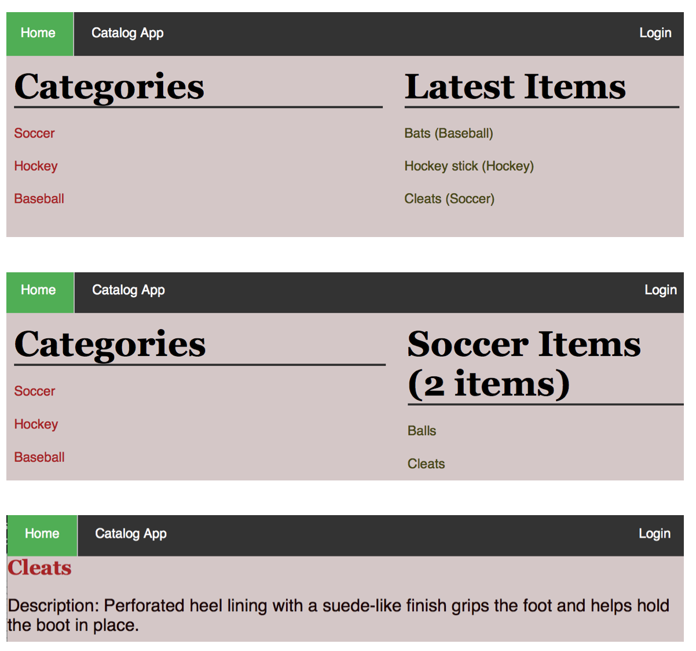
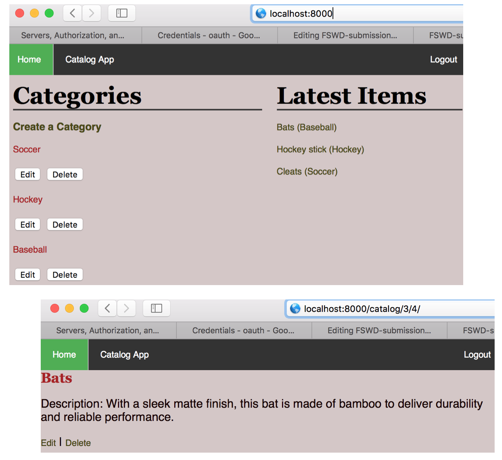
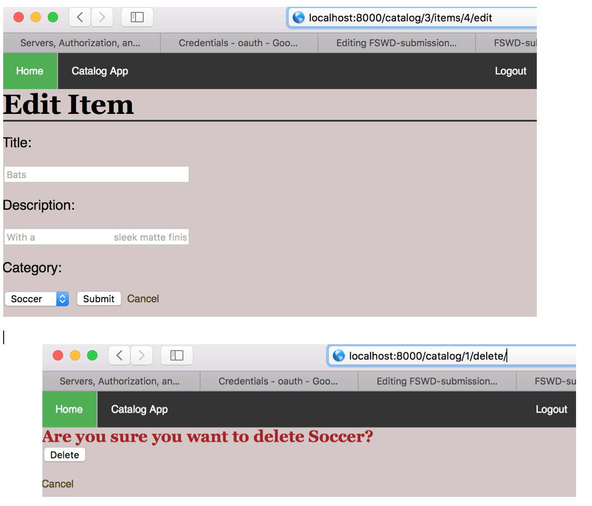
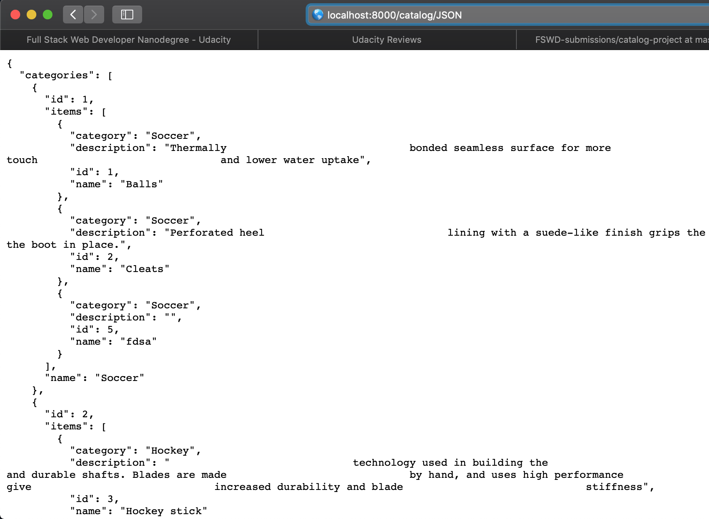

# Project: Item Catalog

This is the submission for Full Stack Web Developer Nanodegree - Project: Item Catalog. The goal is to create an app that provides a list of items within a variety of categories as well as provide a user registration and authentication system. Registered users will have the ability to post, edit and delete their own items. 

## Project file structure

A json file "client_secrets.json" is placed in main project folder for the app's access.

There are three Python source code files:
- "catalog.py": This serves as the main program file which runs the Item Catalog app.
- "database_setup.py": This defines the database structure used in the app.
- "initcategory.py": Running this program will initiate the database file with a few categories and items.

Under the main project folder, there are two subfolders:
- static: Stores the html style CSS file.
- templates: Stores all the html files for the app

## Before running the program

### 1. Install the VM software and configurations

The two tools used are Vagrant and VirtualBox. They can be downlaoded from [vagrant website](https://www.vagrantup.com/downloads.html) and [virtualbox website](https://www.virtualbox.org/wiki/Download_Old_Builds_5_1) respectively. 

For the VM configuration, you can download directly from the FSWD course or use Github to fork and clone the repository https://github.com/udacity/fullstack-nanodegree-vm.

### 2. Clone or download the project folder

Place the project folder in the vagrant folder (inside the configuration directory FSND-Virtual-Machine). 

## Running the program

1. Open a terminal, navigate to the FSND-Virtual-Machine/vagrant directory

2. Use command "vagrant up" and "vagrant ssh" to log into the VM

3. Nav command "cd /vagrant" 

4. Nav to the project folder you just downloaded

5. Run "python database_setup.py"

6. Run "Python initcategory.py"

7. Run "Python catalog.py"

8. Open a browser and type in "http://localhost:8000/catalog" to check out the app

## Output of the program
The following figures show some of the displays of the catalog app. 

*Logged out*

*Logged in*

*JSON endpoint for all categories*
## References

- Udacity FSWD course materials
- Item description texts are from https://www.sportchek.ca
